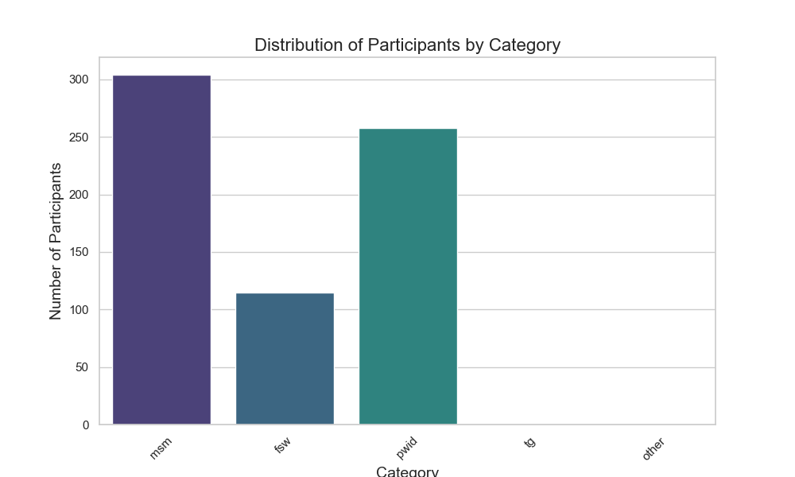

# icap-technial officer-M&E
## github initial setup
```echo "# icap-to-mne" >> README.md
git init
git add README.md
git commit -m "first commit"
git branch -M main
git remote add origin git@github.com:drpyae/icap-to-mne.git
git push -u origin main
```
## Create a Virtual Environment:
```python
python -m venv myenv
```
replace *myenv* with desire environmet name.
## Activate the Virtual Environment:
### Windows:
``` python
.\myenv\Scripts\activate
```
### macOS/Linux:
```python
source myenv/bin/activate 
```

## Select the Python Interpreter:
Once the virtual environment is activated, open the Command Palette by pressing `Ctrl+Shift+P`and type "Python: Select Interpreter." Choose the interpreter located in your virtual environment (it will look something like `.myenv\Scripts\python.exe` or `.myenv/bin/python`).


## install requirements 
```pyhon
 pip install -r requirements.txt
```
## if *openpyxl* installation fail, try install in terminal
```python
pip install openpyxl
```

## Create a .vscode Directory (Optional):
To ensure VSCode always uses the virtual environment, you can create a `.vscode` directory in your project root and add a `settings.json` file with the following content:
```json
{
    "python.pipenvPath": "myenv/bin/python"
}
```
Adjust the path according to your operating system and virtual environment directory.

## run `eda.py` for exploratory data analysis
```python
python eda.py
```
## all result will be stored in `output.txt` file and for visual graph save to your deivce manually
# Summary Statistics Overview
From the summary statistics, we can infer the following:

## Participants: The dataset has 677 entries, with unique identifiers (id) for each entry.
## Categories:
- MSM: 44.9% of the participants are categorized as MSM.
- FSW: 16.9% of the participants are categorized as FSW.
- PWID: 38.1% of the participants are categorized as PWID.
- TG: There are no transgender individuals in the dataset, as indicated by all zeros in the tg column.
- Other: No participants fall under the 'other' category.
## Information Provided:
- HIV Education (hiv_edu): 100% of participants received HIV education.
- Condom/Lubricant Use (cdm_lu): 100% received information on condom/lubricant use.
- HTS Information (hts_info): 94.2% received information on HIV Testing Services.
- STI Information (sti_info): 100% received information on sexually transmitted infections.
- PrEP/PEP Information (prep_pep): 100% received information on PrEP/PEP.

# visualize some of these statistics to make them more engaging and informative

1. Distribution of participants across different categories.

### Observations from Category Distribution
- MSM (Men who have Sex with Men): The largest group, with nearly 305 participants.
- PWID (People Who Inject Drugs): The second-largest group, with about 258 participants.
- FSW (Female Sex Workers): A smaller group, with around 115 participants.
- TG (Transgender) and Other: Both categories have zero participants.
2. Information coverage across various services.

### Observations from Information Coverage Across Services

- HIV Education, Condom Use, STI Information, and PrEP/PEP: All these services are fully covered, with 100% of participants receiving this information.
- HIV Testing Services (HTS): Slightly less coverage, with about 94.2% of participants receiving this information.

# Recommendations Based on Findings
## Key Findings
1. High Prevention Reach:
- Out of 677 participants in the dataset, 638 clients (approximately 94.2%) received all five key prevention services (HIV Education, Condom/Lubricant Use, HIV Testing Services, STI Information, and PrEP/PEP Information).

2. Distribution of Categories:

- The Men who have Sex with Men (MSM) group constitutes the largest segment, making up about 44.9% of the total participants.
- People Who Inject Drugs (PWID) follows with 38.1%.
- Female Sex Workers (FSW) account for 17%.
- Transgender (TG) and Other groups have 0% representation.

3. Comprehensive Service Coverage:

- Most participants received comprehensive prevention services, except for a small percentage who missed at least one service, primarily HIV Testing Services (HTS).

4. Missing Data for TG and Other Categories:

- The absence of data in TG and Other categories highlights potential gaps in outreach and data collection for these key populations.

# Recommendations
1. Strengthen HTS Outreach and Accessibility:

- Objective: Achieve 100% coverage in HIV Testing Services (HTS) to ensure no client is left behind in prevention reach.
- Actions:
    * Implement community-based HTS initiatives to bring services closer to underserved areas.
    * Develop partnerships with local health clinics to provide mobile testing services.
    * Conduct awareness campaigns to emphasize the importance of regular HIV testing.

2. Increase Engagement with Transgender and Other Key Populations:

- Objective: Ensure that the TG and Other categories are adequately represented and receive necessary prevention services.
- Actions:
    * Collaborate with transgender advocacy groups to design inclusive outreach programs.
    * Develop targeted educational materials that address the unique needs and concerns of these populations.
    * Organize focus groups to understand barriers to accessing services and develop strategies to overcome them.

3. Enhance Data Collection and Reporting:

- Objective: Improve the quality and comprehensiveness of data collection to better understand service delivery and client needs.
- Actions:
    * Implement digital data collection tools to ensure accurate and real-time reporting of service coverage.
    * Train field staff on the importance of comprehensive data capture, including detailed demographic information.
    * Conduct regular data audits to identify and address discrepancies in service delivery records.

4. Tailor Prevention Programs for High-Risk Groups:

- Objective: Develop specific interventions for MSM and PWID groups, who form the bulk of the client base.
- Actions:
    * Design culturally sensitive educational campaigns that resonate with the unique experiences of MSM and PWID.
    * Offer support groups and counseling services to address psychosocial challenges faced by these groups.
    * Provide harm reduction services, such as needle exchange programs, specifically targeting PWID populations.

5. Continuous Monitoring and Evaluation:

- Objective: Ensure the ongoing effectiveness and improvement of prevention programs through robust monitoring and evaluation practices.
- Actions:
    * Implement a feedback loop with clients to assess the quality and impact of services received.
    * Use data analytics to identify trends and patterns in prevention reach and adjust programs accordingly.
    * Set up regular review meetings with stakeholders to discuss program performance and explore new opportunities for service enhancement.

# Conclusion

The analysis indicates a commendable reach in delivering comprehensive prevention services to most clients. However, there are still areas requiring attention, particularly in achieving 100% HTS coverage and engaging TG and Other key populations. By addressing these gaps, the program can enhance its impact, ensuring that all clients receive the essential services they need for effective HIV prevention. Implementing these recommendations will not only improve service delivery but also contribute to broader public health goals, ultimately reducing the incidence of HIV within these high-risk populations.